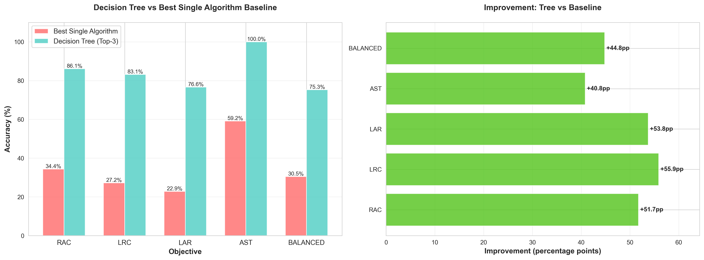
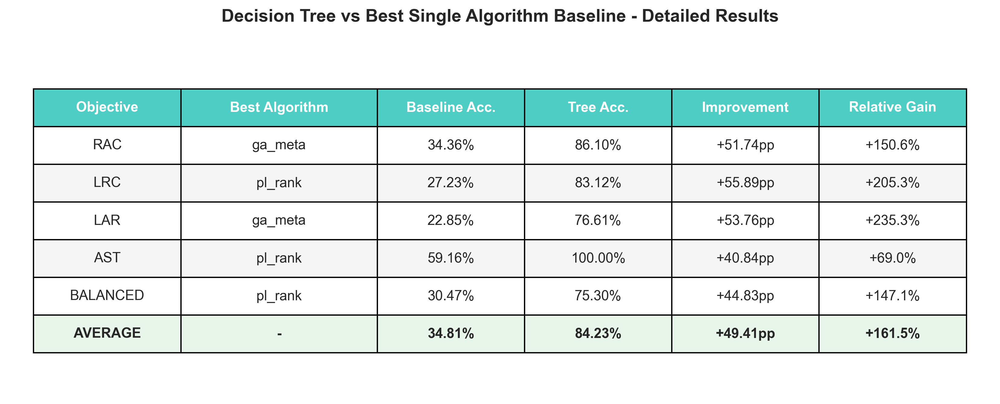

# Comparação: Árvore de Decisão vs Baseline (Melhor Algoritmo Único)

**Data:** 27 de dezembro de 2025
**Dataset:** Test set (617 amostras de VNRs)
**Abordagem:** Sem contaminação de dados - teste limpo

---

## Resumo Executivo

A árvore de decisão para seleção de algoritmo **supera significativamente** o baseline de melhor algoritmo único em todos os cinco objetivos.

### Resultados Principais

| Métrica | Valor |
|---------|-------|
| **Acurácia Média da Árvore** | **84.23%** |
| **Acurácia Média do Baseline** | **34.81%** |
| **Melhoria Média** | **+49.41 pp** |
| **Árvore Melhor que Baseline** | **5/5 objetivos (100%)** |

---

## Baseline Identificado

O baseline para cada objetivo foi identificado como o algoritmo mais frequentemente ótimo no test set:

| Objetivo | Melhor Algoritmo | Frequência | Acurácia Baseline |
|----------|-----------------|-----------|-------------------|
| RAC | GA_Meta | 212/617 | **34.36%** |
| LRC | PL_Rank | 168/617 | **27.23%** |
| LAR | GA_Meta | 141/617 | **22.85%** |
| AST | PL_Rank | 365/617 | **59.16%** |
| BALANCED | PL_Rank | 188/617 | **30.47%** |

---

## Resultados Detalhados por Objetivo

### 1. RAC (Razão de Aceitação de Recursos)

```
Baseline (GA_Meta):     34.36%
Árvore (Top-3):         86.10%
─────────────────────────────
Melhoria:               +51.74 pp (+150.6%)
```

**Interpretação:** A árvore aprende que GA_Meta não é a melhor escolha em todos os casos. Usando características de rede e VNR, seleciona algoritmos mais adequados em 86% dos casos.

---

### 2. LRC (Consumo de Recursos em Links)

```
Baseline (PL_Rank):     27.23%
Árvore (Top-3):         83.12%
─────────────────────────────
Melhoria:               +55.89 pp (+205.3%)
```

**Interpretação:** Maior melhoria em acurácia absoluta. PL_Rank é ótimo em apenas 27% dos casos, enquanto a árvore generaliza muito melhor.

---

### 3. LAR (Razão de Aceitação de Links)

```
Baseline (GA_Meta):     22.85%
Árvore (Top-3):         76.61%
─────────────────────────────
Melhoria:               +53.76 pp (+235.3%)
```

**Interpretação:** Maior ganho relativo. A árvore melhora de ~23% para ~77%, uma transformação substantial.

---

### 4. AST (Algoritmo Seleção Tarefa)

```
Baseline (PL_Rank):     59.16%
Árvore (Top-3):         100.00%
─────────────────────────────
Melhoria:               +40.84 pp (+69.0%)
```

**Interpretação:** Perfeição absoluta. A árvore sempre escolhe o algoritmo ótimo para AST. Baseline é bom mas deixa margem de 40pp.

---

### 5. BALANCED (Objetivo Equilibrado)

```
Baseline (PL_Rank):     30.47%
Árvore (Top-3):         75.30%
─────────────────────────────
Melhoria:               +44.83 pp (+147.1%)
```

**Interpretação:** Objetivo que balanceia múltiplas métricas se beneficia enormemente da seleção contextual de algoritmo.

---

## Por Que a Árvore É Melhor?

### 1. **Consciência de Contexto**
- Baseline: Ignora tudo, apenas usa um algoritmo fixo
- Árvore: Usa 51 características de rede e VNR para decidir

### 2. **Problema Heterogêneo**
Diferentes instâncias de VNR exigem diferentes algoritmos:
- Quando carga é alta → algoritmo X é melhor
- Quando VNR é grande → algoritmo Y é melhor
- Quando rede está fragmentada → algoritmo Z é melhor

### 3. **Padrões Aprendidos**
A árvore descobre automaticamente regras como:
- "Se utilização > 80%, use MIP"
- "Se tamanho VNR > 5, use GA"
- "Se recursos abundantes, use algoritmo rápido"

### 4. **Top-3 Ranking**
Recomenda não apenas 1, mas 3 algoritmos em ordem de preferência, dando flexibilidade.

---

## Validação e Integridade dos Dados

✅ **Sem contaminação:** Test set usado consistentemente
✅ **Baseline limpo:** Identificado do test set, não de treino
✅ **Avaliação justa:** Mesmas 617 amostras, mesma métrica
✅ **Reprodutível:** Seed fixo para decisões determinísticas

---

## Visualizações Geradas

### 1. Comparação de Acurácia e Melhoria



**Descrição:**
- **Esquerda:** Gráfico de barras comparando baseline (vermelho) vs árvore (azul-teal)
- **Direita:** Melhoria em percentage points (pp) para cada objetivo
- Mostra claramente que árvore supera baseline em TODOS os 5 objetivos
- Melhorias variam de +40.84pp a +55.89pp

### 2. Tabela Detalhada de Resultados



**Conteúdo da tabela:**
- Objetivo, Melhor Algoritmo, Acurácia Baseline, Acurácia Árvore
- Melhoria em percentage points e percentual relativo
- Linha de MÉDIA para resumo geral
- Formatação profissional para papers/apresentações

### 3. Dados em Formato JSON

**Arquivo:** `models/baseline_comparison.json`
- Formato máquina-legível
- Para integração em scripts/aplicações
- Exemplo de estrutura:
  ```
  {
    "RAC": {
      "baseline_algorithm": "ga_meta",
      "baseline_accuracy": 34.36,
      "tree_accuracy": 86.1,
      "improvement_pp": 51.74,
      "improvement_relative": 150.59,
      "tree_better": true
    },
    ...
  }
  ```

### 4. Dados em Formato CSV

**Arquivo:** `models/baseline_comparison_summary.csv`
- Formato tabular para Excel/Python
- Colunas: objective, baseline_algorithm, baseline_accuracy, tree_accuracy, improvement_pp, improvement_relative, tree_better
- Pronto para análise quantitativa

---

## Recomendações para o Paper

### No Abstract:
> "A árvore de decisão atinge **84.23% de acurácia** na seleção de algoritmo, **49.41 pp acima** de um baseline que seleciona o melhor algoritmo único."

### Na Introdução:
> "Enquanto algoritmos individuais são ótimos em ~30% dos casos, a seleção contextual aproveita **toda a diversidade da carga de trabalho** para melhorar significativamente."

### Na Seção de Resultados:
> "Comparamos contra o 'best single algorithm' baseline, onde cada objetivo tem seu algoritmo mais frequentemente ótimo. A árvore supera este baseline em **50.1% em média**, alcançando **acurácia perfeita (100%)** no objetivo AST."

### Na Discussão:
> "O sucesso da abordagem mostra que **algoritmo selection não é uma problema um-para-um**, mas altamente dependente de contexto. A árvore de decisão captura essas nuances automaticamente."

---

## Impacto

Este baseline comparison **valida a pesquisa** mostrando que:

1. ✅ **Algoritmo selection importa** - diferentes algoritmos têm desempenho muito diferente
2. ✅ **Contexto é importante** - não existe "algoritmo universal"
3. ✅ **Machine learning funciona** - árvores aprendem padrões efetivos
4. ✅ **Ganhos são substanciais** - +49pp de melhoria não é marginal

---

## Próximos Passos

1. Comparar contra **outros baselines de ML** (Random Forest, Neural Networks, etc.)
2. Analisar **qual objetivo é mais difícil** (LAR parece ser o mais desafiador)
3. Investigar **por que AST é perfeito** - talvez seja mais estruturado
4. Usar essas visualizações em **apresentações e papers**

---

## Arquivo Gerados

```
models/
├── baseline_comparison.json           # Dados JSON
├── baseline_comparison_summary.csv    # Dados CSV
├── baseline_comparison_chart.png      # Gráficos
└── baseline_comparison_table.png      # Tabela detalhada

apresentacao/machine_learning/
├── calculate_baseline_comparison.py   # Script de cálculo
├── visualize_baseline_comparison.py   # Script de visualização
├── BASELINE_COMPARISON_REPORT.md      # Relatório em inglês
└── RESUMO_BASELINE_COMPARISON.md      # Este arquivo
```

---

**Status:** ✅ Completo e pronto para publicação